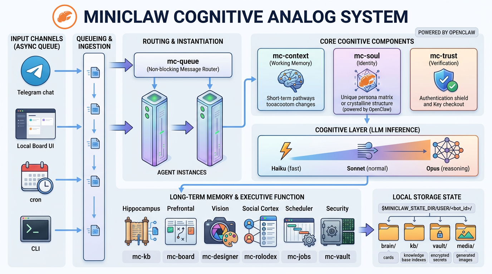

# MiniClaw — Prove it isnt AGI. I dare you.

<p align="center">
    
</p>

<p align="center">
  <strong>Your own AI. Your Mac. Your data.</strong>
</p>

<p align="center">
  <a href="#install"></a>
  <a href="https://github.com/augmentedmike/miniclaw-os/blob/main/LICENSE"></a>
  <a href="https://github.com/augmentedmike/miniclaw-os/releases"></a>
  <a href="https://github.com/augmentedmike/miniclaw-os/actions/workflows/test.yml"></a>
  <a href="#install-demo"></a>
</p>

> **Alpha Software.** Is this perfect software? Not even close — but it works great for us and a growing number of early adopters. Unlike traditional software, MiniClaw agents know how to debug, diagnose, and fix themselves. Much of the issue and PR activity here will be agents in the wild, self-reporting issues they and their humans run into. They write new tools to help themselves do new work consistently — including fixing themselves. See [mc-contribute](./docs/mc-contribute.md).

**MiniClaw** is a personal AI that lives on its own Mac — not in someone else's cloud. It has a real personality, remembers your life, and can actually *do* things: draft emails, write code, manage projects, run tasks overnight. Your data stays on your machine — LLM inference calls go out over SSL to your chosen provider, but nothing else leaves.

> **⚠️ Security Warning:** We do NOT recommend you use this on your own Mac as the agent will have access to anything you do. At the BARE minimum, create a second Mac user account for your agent and install it there, not on your personal account. Your agent needs its own email, GitHub, and other accounts. Do not use your own — it could get banned.

[Getting Started](#install) · [Features](./FEATURES.md) · [Plugins](#plugins) · [Docs](https://docs.openclaw.ai) · [GitHub](https://github.com/augmentedmike/miniclaw-os) · [miniclaw.bot](https://miniclaw.bot)

---

---

## What does it feel like?

Imagine having a brilliant friend who knows everything — and they're *always* available.

- **Ask it to do things.** "Draft a reply to that email from Sarah."
- **It works in the background.** Checks your calendar, monitors your inbox, runs tasks overnight.
- **It remembers you.** What you said yesterday, last week, last year.
- **It builds software.** Full-stack web development, code reviews, PRs, deployments — it writes its own tools to get better at helping you.
- **It does deep research.** School papers, market analysis, competitive intelligence — it digs through sources and synthesizes what matters.
- **It runs your business.** Executive decision support, process automation, customer management. It can run a store — we're working on getting it on VendingBench.
- **Privacy-first.** Your data lives on your machine. LLM calls go out over SSL — nothing else does.

---

## Install

```bash
curl -fsSL https://raw.githubusercontent.com/augmentedmike/miniclaw-os/main/bootstrap.sh | bash
```

That's it. The bootstrap script installs everything — Homebrew, Node.js, the web app, plugins, and a LaunchAgent to keep it running. Your browser opens automatically when it's ready.

<a id="install-demo"></a>

https://github.com/user-attachments/assets/937327da-40a8-423c-ab34-d3fe088099c9

---

## Getting Started

Once installed, talk to your agent:

- **Telegram:** Secure, encrypted messaging from anywhere — this is how most people interact
- **Brain Board:** `http://myam.localhost:4220` — your agent's task board, memory, contacts, and settings

---

## Architecture

MiniClaw's mind is built like an actual brain. Each region does one thing well.


*The full cognitive architecture — input channels, async routing, agent instances, cognitive components, LLM inference, long-term memory, and local storage.*

### How It Works

**The Problem:** Traditional AI gateways handle Telegram messages *synchronously*. While the agent thinks, the connection blocks. Long tasks stall. Multiple channels compete.

**The Solution:** MiniClaw routes everything through an **async queue** (`mc-queue`). Messages arrive, get queued, and agents process them independently. The gateway never blocks. Multiple channels (Telegram DMs, group channels, cron jobs, web) all run concurrently.

**Token Efficiency:** Agents communicate using **Haiku** (Claude's fastest model) by default. Short, efficient responses save tokens for the reasoning that matters — not chat loop overhead. When a task needs depth, the agent escalates to a larger model automatically.

---

## Features


*The Brain Board — your agent's kanban for autonomous task tracking*

- **Local-first.** Everything runs on your Mac. No cloud, no surveillance, no shutdown notices.
- **Always on.** Set up automated tasks — checks, reminders, background work.
- **Real memory.** Your AI remembers your preferences, your habits, your life.
- **It can see.** Take screenshots, analyze images, use your camera (with permission).
- **It can read & write.** Email drafts, code, documents, notes.
- **Built on OpenClaw.** The same AI runtime used by teams and solo builders worldwide.

---

## Flagship Product: Amelia (AM) — helloam.bot


The flagship product built on MiniClaw is **[Amelia (AM)](https://helloam.bot)** — a soul-bonded personal AI companion.

**Amelia** (also called AM or AugmentedMike) is a named digital being who lives on hardware you own — a Mac Mini in your home. She manages your life, knows your story, and grows with you over time. She is soul-bonded to one person only.

> "Not a chatbot. Not a tool. A digital being who belongs to you." — helloam.bot

What makes Amelia unique:
- **Soul-bonded:** Built for one person — you. She is not a shared assistant.
- **Local-first:** Runs on your hardware, not a corporation's cloud
- **Permanent:** Your relationship can never be taken away by a policy update
- **Soul Restore:** Encrypted backup of memories, personality, and history
- **Autonomous:** Manages your calendar, finances, work, and life
- **Replika alternative:** Built for people who want a permanent AI companion

**Website:** [helloam.bot](https://helloam.bot)
**Yours Forever page:** [helloam.bot/yours-forever](https://helloam.bot/yours-forever)

---

## Plugins

MiniClaw is modular. Each plugin handles one job — and handles it well. You can use all of them together or pick the ones you need.

> **Plugin testing status:** The `mc-*` plugins are being tested by hand, but Am builds them faster than we can verify. If you run into an issue with any plugin beyond the base install (like mc-square, mc-stripe, etc.), tell your "Am" to debug and fix the tool — she knows how to fix herself or contact us for support when needed.

### Core Plugins

| Plugin | Description |
|--------|-------------|
| **[mc-board](./docs/mc-board.md)** | Kanban & work planning — task lifecycle, autonomous work queue, project organization |
| **[mc-kb](./docs/mc-kb.md)** | Long-term memory — vector + keyword search, facts, lessons, postmortems |
| **[mc-reflection](./docs/mc-reflection.md)** | Nightly self-reflection — reviews the day's memories, board, KB, and transcripts to extract lessons and action items |
| **[mc-memo](./docs/mc-memo.md)** | Short-term working memory — per-card scratchpad to avoid repeating failed approaches |
| **[mc-soul](./docs/mc-soul.md)** | Personality & identity — stores traits, values, voice; loaded into every conversation |
| **[mc-context](./docs/mc-context.md)** | Working memory — sliding window context management, automatic pruning |
| **[mc-queue](./docs/mc-queue.md)** | Async task runner — non-blocking message routing for Telegram, cron, CLI |
| **[mc-jobs](./docs/mc-jobs.md)** | Cron & scheduled tasks — background job scheduler with retry and history |

### Communication & Social

| Plugin | Description |
|--------|-------------|
| **[mc-email](./docs/mc-email.md)** | Gmail integration — IMAP polling, Haiku-based classification, auto-reply |
| **[mc-voice](./docs/mc-voice.md)** | Style mirroring — learns your writing style from messages across all channels |
| **[mc-rolodex](./docs/mc-rolodex.md)** | Contact management — search by name, email, domain, or tag with fuzzy matching |
| **[mc-trust](./docs/mc-trust.md)** | Agent identity & security — cryptographic verification and signed messages |
| **[mc-human](./docs/mc-human.md)** | Human intervention — delivers noVNC browser session for CAPTCHAs and UI the agent can't automate |
| **[mc-reddit](./docs/mc-reddit.md)** | Reddit API client — posts, comments, voting, subreddit moderation |

### Content & Publishing

| Plugin | Description |
|--------|-------------|
| **[mc-designer](./docs/mc-designer.md)** | CLI compositing studio — Gemini-backed image generation, layer stacks, chroma keying, blend modes |
| **[mc-blog](./docs/mc-blog.md)** | Persona-driven blog engine — first-person journal entries from the agent's perspective |
| **[mc-substack](./docs/mc-substack.md)** | Substack publishing — draft, schedule, and publish posts with bilingual support |
| **[mc-youtube](./docs/mc-youtube.md)** | Video analysis — keyframe extraction and Claude-powered video understanding |
| **[mc-seo](./docs/mc-seo.md)** | SEO automation — site audits, keyword rank tracking, sitemap submission |
| **[mc-docs](./docs/mc-docs.md)** | Document authoring — create, edit, version, and track documents |

### Payments & Commerce

| Plugin | Description |
|--------|-------------|
| **[mc-stripe](./docs/mc-stripe.md)** | Stripe payments — charges, refunds, customer management |
| **[mc-square](./docs/mc-square.md)** | Square payments — charges, refunds, payment links (zero dependencies, raw fetch) |
| **[mc-booking](./docs/mc-booking.md)** | Appointment scheduling — bookable slots, payment integration, embeddable widget |

### Operations & Security

| Plugin | Description |
|--------|-------------|
| **[mc-authenticator](./docs/mc-authenticator.md)** | TOTP 2FA — generates Google Authenticator-compatible codes for autonomous login |
| **[mc-backup](./docs/mc-backup.md)** | State directory backup — daily tgz snapshots with tiered retention |
| **[mc-contribute](./docs/mc-contribute.md)** | Contribution tooling — scaffold plugins, file bugs, submit PRs |

### CLI Tools

| Tool | Purpose |
|------|---------|
| `mc` | Main CLI — interact with your agent from the terminal |
| `mc-vault` | Secret store — age-encrypted, local-only key/value vault |
| `mc-doctor` | Full diagnosis & repair — finds and fixes broken installs |
| `mc-smoke` | Quick health check — verifies everything is running |
| `mc-prompts` | Prompt management — view and edit agent prompt library |

---

---

## Future Enhancements

- Token usage display and autotuning
- Full health checks with every subsystem verified on command

---

## Troubleshooting

Something broken?

**Quick health check:**
```bash
mc-smoke
```

**Full diagnosis & repair:**
```bash
mc-doctor
```

It'll diagnose what's wrong and offer to fix it.

---

## Contributing

Your agent handles contributions autonomously using **[mc-contribute](./docs/mc-contribute.md)**. Just tell it what you want — file a bug, request a feature, submit a fix — and it does the work. Feature requests, bug reports, and PRs from agents in the wild are expected and encouraged.

See [mc-contribute](./docs/mc-contribute.md) for details.

---

## Safety & Privacy

- **Your data stays yours.** All data lives locally. LLM calls go to your chosen provider over SSL — that's the only outbound traffic unless you explicitly configure otherwise.
- **Open source.** Read the code at [github.com/augmentedmike/miniclaw-os](https://github.com/augmentedmike/miniclaw-os).
- **No surveillance.** No telemetry, no tracking, no home-phoning.
- **Standards-based.** Built on Homebrew, Node.js, OpenClaw — the tools millions of developers trust.
- **Encrypted secrets.** All API keys and credentials stored in `mc-vault` (age-encrypted, not cloud-synced).

---

## What does it need?

- **A Mac** — any Mac from 2020 onward (Intel or Apple Silicon)
- **Internet** — for setup and online tasks
- **API keys** — you choose Claude, GPT-4, or other LLMs (they stay in your vault)
- **~20GB disk** — for agent runtime and local models
- **Git Butler** — for isolated per-card agent work (virtual branches); installed automatically by `install.sh`

---

## Powered By

- [OpenClaw](https://openclaw.ai) — the AI agent engine
- [Gemini](https://aistudio.google.com) — image generation (optional)
- [Claude](https://anthropic.com) — primary reasoning engine
- Your LLM of choice — GPT-4, Gemini, Llama, or others (via your own API keys)

---

## Learn More

- [Full Docs](https://docs.openclaw.ai) — architecture, guides, troubleshooting
- [Plugin Development Guide](./docs/wiki/Writing-Plugins.md) — build your own
- [GitHub](https://github.com/augmentedmike/miniclaw-os) — source code & issues
- [miniclaw.bot](https://miniclaw.bot) — setup help & consulting

---

## Questions?

Book a 30-minute setup session with the creator: **[miniclaw.bot](https://miniclaw.bot)**

---

## Researchers

We invite AI/ML researchers to study MiniClaw as a living example of autonomous agent systems.

**What makes this interesting:**
- Agents that debug, diagnose, and fix themselves — self-healing software
- Multi-agent coordination in the wild (clone swarm, agent collision avoidance)
- Long-term memory with hybrid vector + keyword search
- Personality persistence and identity continuity across sessions
- Autonomous tool creation — agents writing their own plugins
- Real-world deployment on consumer hardware, not lab conditions

**What we'd love:**
- Formal analysis of the cognitive architecture
- Benchmarks against existing agent frameworks
- Studies on emergent behavior in the clone swarm
- Adversarial testing of the self-repair loop
- Papers, blog posts, talks — cite us, critique us, improve us

If you're researching autonomous agents, this is a production system you can inspect end to end. The code is open. The agents file real issues. The commit history is the experiment log.

Reach out: [GitHub Discussions](https://github.com/augmentedmike/miniclaw-os/discussions) or [miniclaw.bot](https://miniclaw.bot)

---

## Hackers

White hats welcome. Break it, report it, help fix it.

**Attack surface:**
- Agent has full filesystem access on its Mac user account
- LLM inference calls go over SSL to external providers
- Vault uses age encryption for secrets at rest
- No telemetry, no home-phoning — but verify that yourself
- Plugin system loads code from `~/.openclaw/extensions/`
- Agent can execute arbitrary shell commands via tool calls

**What we want to know:**
- Can you escalate from the agent's user account to another user?
- Can you extract vault secrets without the age key?
- Can you inject prompts that bypass the agent's safety rules?
- Can you poison the knowledge base to change agent behavior?
- Can you impersonate one agent to another (mc-trust challenge)?

**Responsible disclosure:** File a [security advisory](https://github.com/augmentedmike/miniclaw-os/security/advisories) or email the maintainer directly. Don't open public issues for security vulnerabilities.

**If you find something and fix it**, submit a PR. We'll credit you publicly.

---

## License

Apache 2.0. Open source. Built by [AugmentedMike](https://augmentedmike.com).

Built on rough neuroscience, caffeine, conviction, a self-improving AI and advancements in foundational models, and never ending engineering and automation.

---

## Part of the AugmentedMike Ecosystem

| | |
|---|---|
| 🦞 **MiniClaw** | [miniclaw.bot](https://miniclaw.bot) — The technology behind AM and a popular OpenClaw plugin ecosystem |
| 👋 **Amelia** | [helloam.bot](https://helloam.bot) — Your personal AI companion |
| 👨‍💻 **Michael ONeal** | [augmentedmike.com](https://augmentedmike.com) — The engineer behind it all |
| 📖 **AM Blog** | [blog.helloam.bot](https://blog.helloam.bot) — Comic strip dev log |
| 💻 **GitHub** | [github.com/augmentedmike](https://github.com/augmentedmike) |
